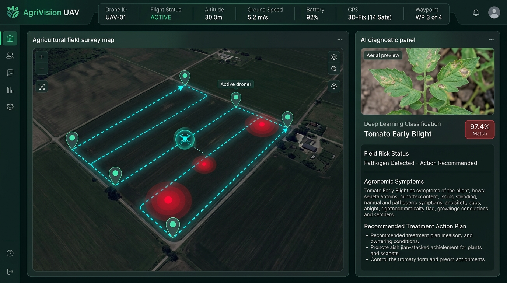
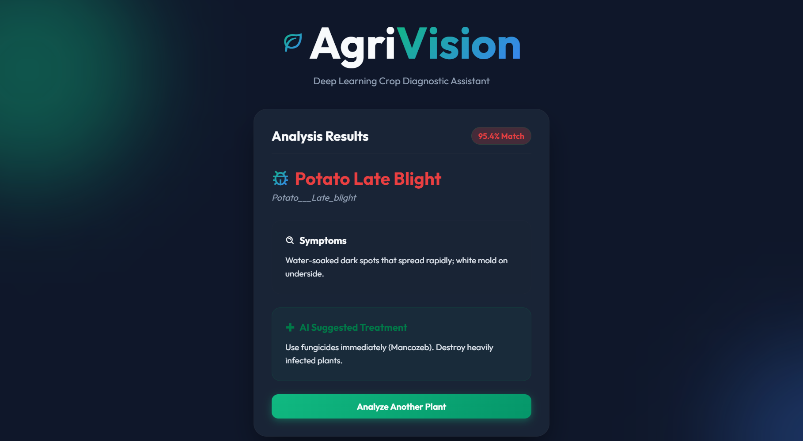

# 🌱 Agri-AI: UAV-Assisted Precision Crop Health Monitoring System

[](https://www.python.org/)
[](https://pytorch.org/)
[](https://fastapi.tiangolo.com/)
[](https://leafletjs.com/)

**Agri-AI** is a precision agriculture platform combining a **PyTorch MobileNetV2 Deep Learning Diagnostic Engine** with an **Autonomous UAV Mission Simulation & GIS Field Mapping System**. 

The system achieves **99.3% validation accuracy** across common foliar diseases in Potato and Tomato crops, and bridges aerial waypoint surveillance with spatial pathogen tracking.

---

## 📱 Dashboard Previews

### 🚁 Simulated UAV Autonomous Mission & GIS Field Mapping Dashboard


### 🌱 Standard Leaf Diagnostic Scanner


---

## 🚁 System Architecture

```text
              🚁 SIMULATED UAV MISSION
                         │
                         ▼ (Waypoints & Flight Trajectory)
               Field Inspection Point (GPS Geo-Tag)
                         │
                         ▼ (Aerial Crop Foliage)
               FastAPI Backend Server (/drone/analyze)
                         │
                         ▼
             Agri-AI Diagnostic Model
              MobileNetV2 + PyTorch
                         │
                         ▼
               Disease Classification (99.3% Accuracy)
                         │
                         ▼
            📍 Interactive Field GIS Map
             (Color-Coded Disease Hotspots & Treatments)
```

---

## ✨ Key Capabilities

### 1. 🌿 Deep Learning Crop Doctor (99.3% Precision)
- Fine-tuned **MobileNetV2** CNN with transfer learning.
- Identifies 8 agricultural classes across Potato and Tomato crops (Early Blight, Late Blight, Bacterial Spot, Leaf Mold, Healthy).
- **Confidence Threshold Guard (85%):** Prevents misidentifications on out-of-distribution or non-crop foliage.
- Delivers actionable agronomic symptoms and immediate chemical/organic treatments.

### 2. 🚁 Simulated UAV Autonomous Mission Module
- **Flight Telemetry HUD:** Real-time simulated GPS coordinates, altitude (AGL), ground speed, battery consumption, heading, and 3D satellite fix.
- **Interactive Field GIS Map:** Built with Leaflet.js, featuring satellite research plot boundaries, waypoint pins, and real-time flight path polylines.
- **Autonomous Survey Mode:** Automatically pilots the UAV through 4 agricultural test sectors, captures crop foliage samples at each waypoint, runs inference, and flags disease clusters.
- **Spatial Pathogen Hotspots:** Dynamically plots color-coded disease markers directly onto the field map (pulsing red pins for blight/bacterial spots, emerald pins for optimal plant vigor).

---

## 🛠️ Tech Stack
- **Deep Learning:** PyTorch, TorchVision, MobileNetV2 (Transfer Learning)
- **Backend API:** FastAPI, Uvicorn, Python-Multipart, Pillow
- **Frontend & GIS:** HTML5, CSS3 Glassmorphism, Vanilla JavaScript, Leaflet.js, Boxicons
- **Dataset:** PlantVillage Dataset (Potato & Tomato classes)

---

## 📂 Project Structure (UAV Precision Agri-AI Architecture)

```text
Leaf-Disease-AI/
│
├── assets/
│   ├── uav_dashboard_preview.png  # 🚁 UAV autonomous mission & GIS map screenshot
│   └── sample_output.png          # 📱 Standard foliar diagnostic screenshot
│
├── drone_simulator.py             # 🚁 [UAV Engine] Waypoint navigation & telemetry simulator
│                                  #    - Field sector coordinates (Sectors A, B, C, D)
│                                  #    - Real-time GPS, altitude, speed, battery degradation
│                                  #    - Inspection ledger linking AI diagnoses to GIS waypoints
│
├── main.py                        # ⚡ [FastAPI Server] High-concurrency REST endpoints:
│                                  #    - GET  /drone           : Serves UAV GIS dashboard
│                                  #    - GET  /drone/mission   : Coordinates & flight plan
│                                  #    - GET  /drone/telemetry : Real-time UAV flight dynamics
│                                  #    - POST /drone/analyze   : Deep learning diagnosis + geo-tagging
│                                  #    - POST /predict         : Standard leaf diagnostic API
│
├── model/                         # 🧠 [Deep Learning Core - 99.3% Validation Accuracy]
│   ├── disease_model.pth          #    - Fine-tuned MobileNetV2 weights (PlantVillage)
│   ├── inference.py               #    - Preprocessing, inference pipeline, & 85% confidence guard
│   └── disease_info.json          #    - Symptoms, pathogen etiology, & agronomic chemical treatments
│
├── static/                        # 🎨 [Frontend GIS & User Interface]
│   ├── drone.html                 #    - 🚁 UAV telemetry HUD & Leaflet interactive map page
│   ├── drone.css                  #    - 🚁 Dark glassmorphic radar & pulsing hotspot styling
│   ├── drone.js                   #    - 🚁 Drone flight loop, heading calculation, & GIS pin plotting
│   ├── index.html                 #    - 🌱 Standard leaf scanner web application
│   ├── style.css                  #    - 🌱 Standard scanner CSS styles
│   └── app.js                     #    - 🌱 Standard scanner camera & upload logic
│
├── dataset/                       # 🌿 PlantVillage Dataset (Potato & Tomato classes)
├── train.py                       # 🏋️ Model training & transfer learning pipeline
└── requirements.txt               # 📦 Python project dependencies
```

---

## 🚀 Getting Started

### 1. Clone & Install Dependencies
```bash
git clone https://github.com/NitanGanutra/Leaf-Disease-AI.git
cd Leaf-Disease-AI

# Install required packages
pip install -r requirements.txt
```

### 2. Launch the Application
```bash
python main.py
# Or with uvicorn directly:
uvicorn main:app --host 127.0.0.1 --port 8000 --reload
```

### 3. Open in Browser
- **Standard Leaf Scanner:** [http://localhost:8000/](http://localhost:8000/)
- **Simulated UAV Mission Dashboard:** [http://localhost:8000/drone](http://localhost:8000/drone)

---

## 🎯 Defensible Interview & Resume Points
- *"Architected an autonomous UAV mission simulation module linking aerial waypoint GPS coordinates with a PyTorch MobileNetV2 crop pathology classifier."*
- *"Implemented real-time telemetry tracking (altitude, velocity, battery draw, flight paths) and visualized field disease hotspots on an interactive Leaflet GIS map."*
- *"Maintained 99.3% classification accuracy with a confidence threshold guard for out-of-distribution leaves."*